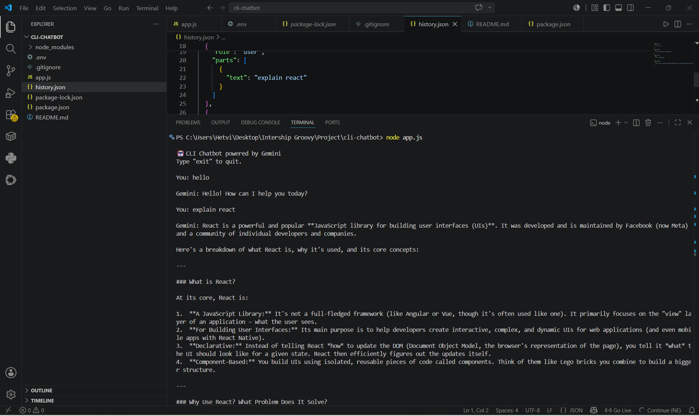
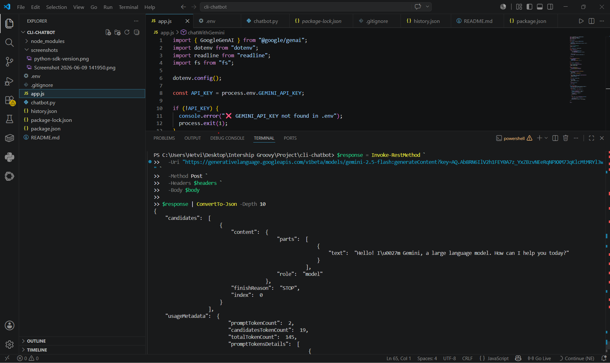
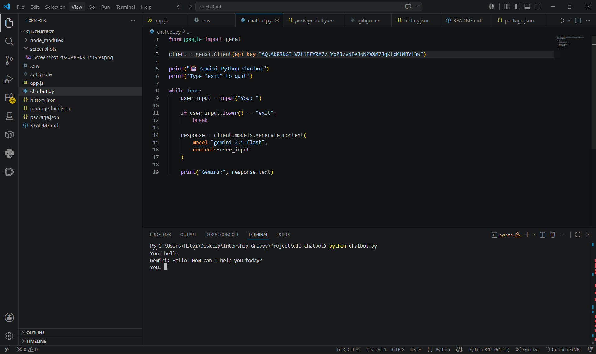

# 🤖 CLI Chatbot Powered by Gemini API

A simple multi-turn command-line chatbot built with **Node.js** and the **Google Gemini API**. The chatbot maintains conversation history across sessions using a local JSON file, allowing users to continue conversations even after restarting the application.

---

## 📌 Features

* 💬 Multi-turn conversational chatbot
* 🧠 Persistent chat history using `history.json`
* 🔑 Secure API key management with `.env`
* ⚡ Built with modern JavaScript (ES Modules)
* 🛡️ Error handling for API, network, and quota issues
* 📂 Automatically loads previous conversations on startup
* 🖥️ Terminal-based interface (CLI)

---

## 🛠️ Tech Stack

* Node.js
* JavaScript (ES Modules)
* Google Gemini API
* dotenv
* readline
* fs (File System)

---

## 📋 Prerequisites

Before running the project, ensure you have:

* Node.js v18 or later
* npm
* Google Gemini API Key

Check versions:

```bash
node --version
npm --version
```

Get your Gemini API Key from:

https://aistudio.google.com/app/apikey

---

## 🚀 Installation

### 1. Clone the Repository

```bash
git clone https://github.com/Hetvi2211/cli-chatbot.git
cd cli-chatbot
```

### 2. Install Dependencies

```bash
npm install
```

### 3. Configure Environment Variables

Create a `.env` file in the project root:

```env
GEMINI_API_KEY=your_api_key_here
```

---

## ▶️ Run the Application

```bash
node app.js
```

---

## 📸 Demo






---

## 🧠 How It Works

1. User enters a message in the terminal.
2. Message is added to conversation history.
3. Full history is sent to Gemini API.
4. Gemini generates a response.
5. Response is displayed in the terminal.
6. Conversation is saved to `history.json`.
7. Previous history is automatically loaded on next startup.

---

## ⚙️ Configuration

Inside `app.js`:

```javascript
const MODEL = "gemini-2.0-flash";
const MAX_OUTPUT_TOKENS = 1024;
```

### Available Gemini Models

| Model            | Description                    |
| ---------------- | ------------------------------ |
| gemini-2.5-pro   | Most capable reasoning model   |
| gemini-2.0-flash | Fast and efficient             |
| gemini-2.5-flash | Faster with strong performance |

---

## ⚠️ Common Issues

### Quota Exceeded (429)

```text
You exceeded your current quota
```

**Solution:**

* Check API usage limits
* Wait for quota reset
* Verify billing and API access

---

### Authentication Error (401)

```text
Invalid API Key
```

**Solution:**

* Verify `.env` file
* Ensure `GEMINI_API_KEY` is correct

---

### Network Error

```text
ENOTFOUND
```

**Solution:**

* Check internet connection
* Verify firewall settings

---

## 🔒 Environment Variables

Required:

```env
GEMINI_API_KEY=your_api_key_here
```

Never commit your actual `.env` file to GitHub.

---

## 📚 Learning Outcomes

This project helped in understanding:

* LLM API integration
* API authentication
* Environment variables
* Async/Await in Node.js
* File handling with Node.js
* Multi-turn conversation management
* Error handling in API applications

---

## 🔮 Future Improvements

* Streaming responses
* Web-based UI using React
* Voice input support
* Database-backed chat history
* Multiple chatbot personalities
* Markdown rendering
